<!-- vscode-markdown-toc -->
* 1. [程序设计与C语言](#C)
	* 1.1. [头文件与注释](#)
	* 1.2. [格式化输出说明](#-1)
	* 1.3. [常见转义字符](#-1)
	* 1.4. [比较操作示例](#-1)
	* 1.5. [使用 `scanf` 输入数据](#scanf)
	* 1.6. [C语言程序的基本结构](#C-1)
	* 1.7. [程序运行步骤](#-1)
	* 1.8. [程序设计任务](#-1)
	* 1.9. [注意事项](#-1)
* 2. [算法 程序灵魂](#-1)
	* 2.1. [什么是算法](#-1)
	* 2.2. [算法的特性](#-1)
	* 2.3. [怎样表示算法](#-1)
		* 2.3.1. [改善流程图弊端](#-1)
	* 2.4. [N-S结构化流程图](#N-S)
	* 2.5. [伪代码表示](#-1)
	* 2.6. [结构化程序设计方法](#-1)
* 3. [简单C程序设计 -- 顺序程序设计](#C--)
	* 3.1. [数据的表现形式及其运算](#-1)
	* 3.2. [数据类型](#-1)
		* 3.2.1. [1. 基本数据类型（Basic Data Types）](#BasicDataTypes)
		* 3.2.2. [2. 构造数据类型（Derived Data Types）](#DerivedDataTypes)
		* 3.2.3. [3. 指针类型（Pointer Types）](#PointerTypes)
		* 3.2.4. [4. 空类型（Void Type）](#VoidType)
		* 3.2.5. [5. 限定符（Type Qualifiers）](#TypeQualifiers)
		* 3.2.6. [格式化输出对应关系](#-1)
		* 3.2.7. [优先级与结和性](#-1)
	* 3.3. [不同数据类型的运算](#-1)
	* 3.4. [强类型转换](#-1)
	* 3.5. [C语句](#C-1)
	* 3.6. [输入输出](#-1)
		* 3.6.1. [1. 基本输入输出函数](#-1)
		* 3.6.2. [2. 其他输入输出函数](#-1)
		* 3.6.3. [3. 使用注意事项](#-1)
* 4. [选择结构和条件判断](#-1)
	* 4.1. [条件运算符条件表达式](#-1)
	* 4.2. [选择嵌套](#-1)
* 5. [循环结构](#-1)
	* 5.1. [改变循环状态](#-1)
* 6. [利用数组处理批量数据](#-1)
* 7. [关键字](#-1)
* 8. [附录](#-1)

<!-- vscode-markdown-toc-config
	numbering=true
	autoSave=true
	/vscode-markdown-toc-config -->
<!-- /vscode-markdown-toc -->
# C语言学习笔记

##  1. <a name='C'></a>程序设计与C语言

```c
#include <stdio.h>      // 编译预处理指令

// int 表示返回类型
int main()              // 主函数 -- 程序入口
{
    // 要完成的功能
    printf("hello world\n"); // 函数调用
    return 0;                // 返回值为整数0
}
```

###  1.1. <a name=''></a>头文件与注释

- `#include`：包含/引用头文件
- `stdio.h`：标准输入输出头文件
- **注释方式**
  - `//`：单行注释
  - `/* ... */`：多行注释

###  1.2. <a name='-1'></a>格式化输出说明

| 数据类型 | 描述           |
| :------- | :------------- |
| `%d`     | 整数           |
| `%f`     | 浮点数         |
| `%lf`     | 长浮点数         |
| `%c`     | 字符           |
| `%s`     | 字符串         |
| `%%`     | 输出一个百分号 |
| `%x`     | 十六进制数     |
| `%o`     | 八进制数       |
| `%u`     | 无符号整数     |
| `%e`     | 指数表示法     |

###  1.3. <a name='-1'></a>常见转义字符

| 转义字符 | 描述         |
| :------- | :----------- |
| `\n`     | 换行         |
| `\t`     | 制表符       |
| `\r`     | 回车         |
| `\b`     | 退格         |
| `\f`     | 换页         |
| `\'`     | 单引号       |
| `\"`     | 双引号       |
| `\\`     | 反斜杠       |
| `\0`     | 空字符       |
| `\a`     | 响铃         |
| `\v`     | 垂直制表符   |

###  1.4. <a name='-1'></a>比较操作示例

```c
int compare() 
{
    int a = 10, b = 20;
    if (a > b) 
        printf("a > b\n");
    else if (a < b) 
        printf("a < b\n");

    return 0;
}
```

###  1.5. <a name='scanf'></a>使用 `scanf` 输入数据

```c
void use_scanf()
{
    int a = 0; // 如果没有赋值则为随机值
    int b = 0;

    /*
     * %d 表示要输入两个整型，加取址符号 & 表示存放的位置
     * 其中输入的格式必须和输出的格式一致
     * 输入的格式为：%d %d
     * 输入的数据为：10 20
     * 输入格式为：%d,%d
     * 输入数据为：10,20
     */
    scanf("%d %d", &a, &b); 
    compare(a, b);
}
```

###  1.6. <a name='C-1'></a>C语言程序的基本结构

1. 一个程序由一个或多个源程序文件组成。
   - 每个源文件包括三部分：
     - 预处理指令（如导入头文件、设置宏）
     - 全局声明（在函数定义之前声明变量）
     - 函数定义（需在调用前定义）

2. 函数是C语言的重要组成部分。
   - 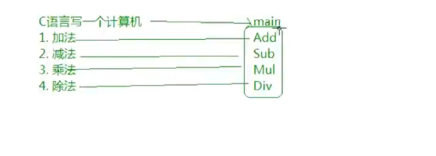

3. 一个函数包含两个主要部分：
   - **函数首部**
     - 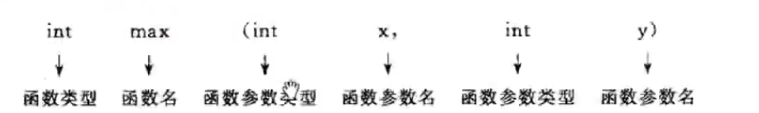
   - **函数体**
     - 声明部分（如 `int max(int a, int b);`）
     - 执行部分（具体操作语句）

4. 程序中的所有操作都是通过函数中的C语句执行的。

5. 每条语句末尾必须以分号 `;` 结尾。

6. C语言本身不提供输入输出语句；这些功能由库函数提供。

7. 程序应包含适当的注释以提高可读性和维护性。

###  1.7. <a name='-1'></a>程序运行步骤

1. 在上位机中编写并编辑源代码。
2. 对源程序进行编译。
    1. 预编译   --      预处理
    2. 编译     --      有无语法错误 形成目标程序 xx.obj
    3. 链接     --      链接多个目标程序形成可执行程序 xx.exe(由众多.obj文件)
3. 运行程序。
> 示意图

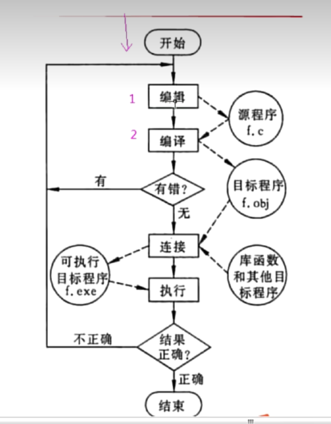

###  1.8. <a name='-1'></a>程序设计任务

1. 问题分析
2. 设计算法
3. 编写程序
4. 对源程序进行编辑，编译和链接
5. 运行程序，分析结果
6. 编写程序文档

###  1.9. <a name='-1'></a>注意事项

- 若声明变量但未初始化，则其值为随机值。
  ```c
  int a; // 值为随机
  ```

- `&` 是取地址运算符，用于获取变量的内存地址。

- 函数声明应在调用前完成，建议放在文件开头或头文件中。

- 一个工程可以包含多个源文件，它们之间可以相互调用函数。

- 一个工程中只能有一个 `main()` 函数。
  - CMake 编译时可以指定多个源文件参与编译。

##  2. <a name='-1'></a>算法 程序灵魂

1. 程序主要包含两方面信息
    1. 对数据描述
        1. 用到哪些数据
        2. 数据的组织形式
    2. 对操作的描述
        1. 所用配料
        2. 操作步骤

> 程序 = 算法 ＋ 数据结构；还需要结构化的程序设计方法

###  2.1. <a name='-1'></a>什么是算法

* 算法是解决 `做什么` 与 `怎么做`的问题

1. 算法分为两大类
    1. 数值运算
    2. 非数值运算

###  2.2. <a name='-1'></a>算法的特性

1. 有穷性
  1. 步骤是有限的，不能无限进行
2. 确定性
  1. 每个步骤都是确定的，不是含糊的，模棱两可
  2. 输入确定，输出也确定
3. 有零个或多个输入
4. 有一个或多个输出
5. 有效性

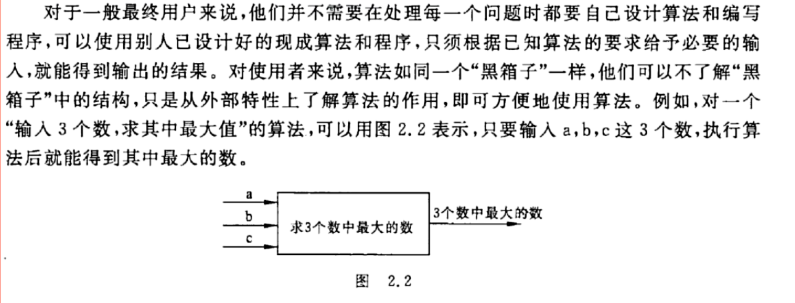 

###  2.3. <a name='-1'></a>怎样表示算法

1. 自然语言表示
2. 流程图表示

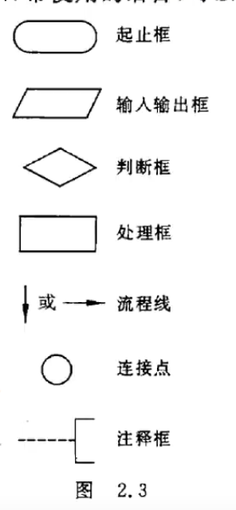

> 例子

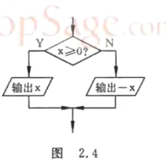

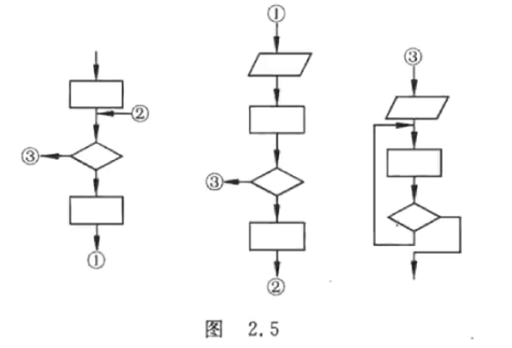

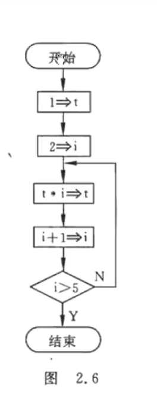

* 为了提高质量，必须限制箭头的滥用，不允许无规律的使流程随意转向，只能顺序的进行下去

####  2.3.1. <a name='-1'></a>改善流程图弊端

1. 三种基本结构
  1. 顺序`执行/结构`
  2. 选择`执行/结构`
  3. 重复`执行/结构`
    1. while
    2. until `do while`

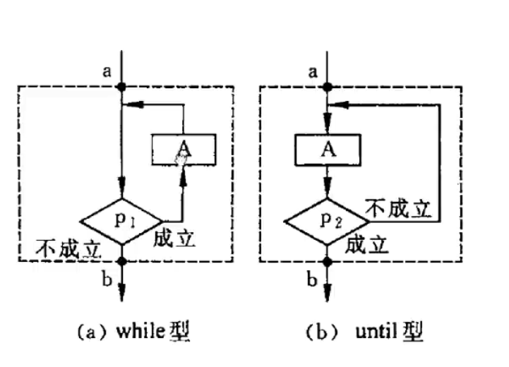

###  2.4. <a name='N-S'></a>N-S结构化流程图

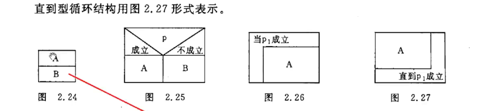

###  2.5. <a name='-1'></a>伪代码表示

> 介于自然语言与计算机语言

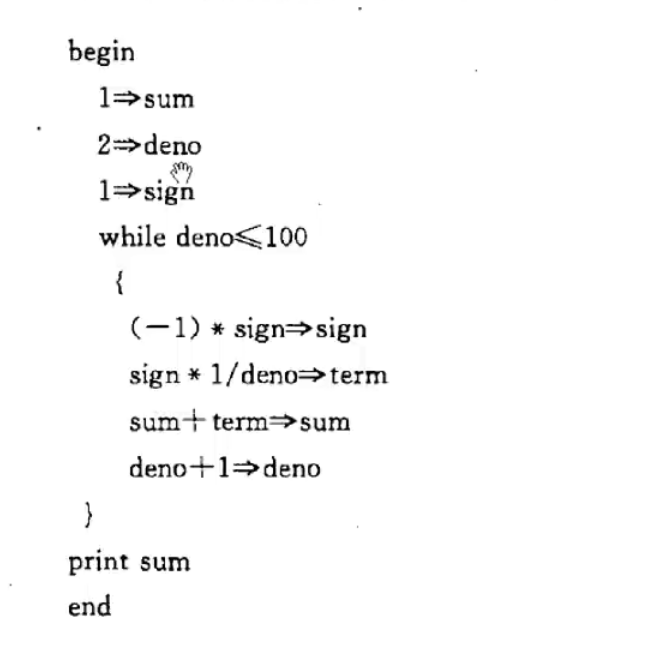

###  2.6. <a name='-1'></a>结构化程序设计方法

1. 自顶而下
2. 逐步细化
3. 模块化设计
4. 结构化编码

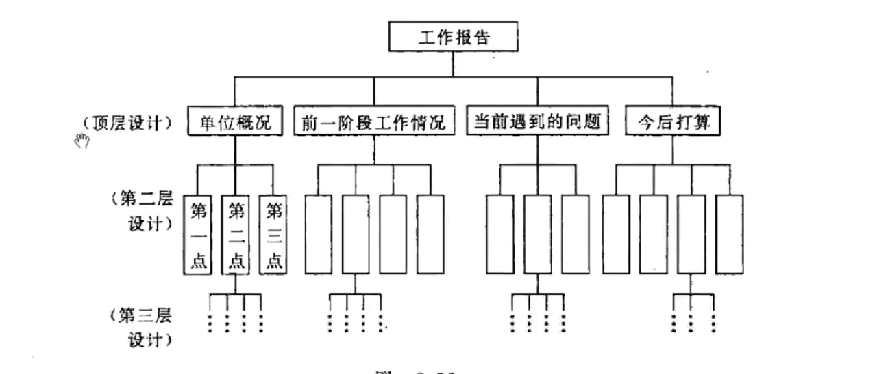

* 划分子模块注意模块的独立性，耦合性越少越好


##  3. <a name='C--'></a>简单C程序设计 -- 顺序程序设计

###  3.1. <a name='-1'></a>数据的表现形式及其运算

* 常量
  * 整型常量
  * 实型常量
    * 十进制小数:`123.456`
    * 指数表示法:`12.34e3`
    * 字符常量
* 变量
  * 先定义再应用
* 
* C语言规定标识符只能由字母，数字，下划线3种字符组成，且第一个字符必须为字母或下划线
> 常变量与常量区别：常量是值，常变量是变量

###  3.2. <a name='-1'></a>数据类型

> 对数据分配存储单元的安排，包括存储单元的长度以及数据的存储形式。不同的类型分配不同的长度和存储形式

####  3.2.1. <a name='BasicDataTypes'></a>1. 基本数据类型（Basic Data Types）

##### 整型（Integer Types）
| 类型 | 关键字 | 大小（通常） | 范围 |
|------|--------|-------------|------|
| 短整型 | `short` 或 `short int` | 2字节 | -32,768 到 32,767 |
| 整型 | `int` | 4字节 | -2,147,483,648 到 2,147,483,647 |
| 长整型 | `long` 或 `long int` | 4字节（32位）或8字节（64位） | 取决于平台 |
| 长长整型 | `long long` 或 `long long int` | 8字节 | -2^63 到 2^63-1 |

> int类型存储形式为补码
[源码，反码，补码](./doc/源码，反码，补码.md)

##### 字符型（Character Types）
| 类型 | 关键字 | 大小 | 范围 |
|------|--------|------|------|
| 字符型 | `char` | 1字节 | -128 到 127 或 0 到 255 |
| 无符号字符型 | `unsigned char` | 1字节 | 0 到 255 |

##### 浮点型（Floating-Point Types）
| 类型 | 关键字 | 大小 | 范围 | 精度 |
|------|--------|------|------|------|
| 单精度浮点型 | `float` | 4字节 | ±3.4E+38 | 6-7位小数 |
| 双精度浮点型 | `double` | 8字节 | ±1.7E+308 | 15-16位小数 |
| 长双精度浮点型 | `long double` | 10/12/16字节 | 取决于平台 | 取决于平台 |

##### 无符号整型（Unsigned Integer Types）
| 类型 | 关键字 | 大小 | 范围 |
|------|--------|------|------|
| 无符号短整型 | `unsigned short` | 2字节 | 0 到 65,535 |
| 无符号整型 | `unsigned int` 或 `unsigned` | 4字节 | 0 到 4,294,967,295 |
| 无符号长整型 | `unsigned long` | 4/8字节 | 0 到 2^32-1 或 2^64-1 |
| 无符号长长整型 | `unsigned long long` | 8字节 | 0 到 2^64-1 |

####  3.2.2. <a name='DerivedDataTypes'></a>2. 构造数据类型（Derived Data Types）

##### 数组（Array）
- 一组相同类型数据的集合
- 示例：`int arr[10];`

##### 结构体（Structure）
- 不同类型数据的集合
- 示例：
```c
struct Student {
    int id;
    char name[20];
    float score;
};
```

##### 共用体（Union）
- 共享内存的不同类型数据
- 示例：
```c
union Data {
    int i;
    float f;
    char str[20];
};
```

##### 枚举（Enumeration）
- 定义一组命名的整型常量
- 示例：
```c
enum Color {RED, GREEN, BLUE};
```

####  3.2.3. <a name='PointerTypes'></a>3. 指针类型（Pointer Types）
- 存储内存地址的类型
- 示例：
```c
int *ptr;        // 整型指针
char *str;       // 字符指针
void *vptr;      // 通用指针
```

####  3.2.4. <a name='VoidType'></a>4. 空类型（Void Type）
- `void` 表示无类型
- 常用于函数返回值或参数声明
- 示例：
```c
void function(void);  // 无参数无返回值函数
void *ptr;            // 通用指针
```

####  3.2.5. <a name='TypeQualifiers'></a>5. 限定符（Type Qualifiers）

##### const
- 声明常量，值不可修改
- 示例：`const int MAX = 100;`

##### volatile
- 告诉编译器该变量可能被意外改变
- 示例：`volatile int flag;`

##### restrict（C99）
- 用于指针，表示唯一访问该对象的方式
- 示例：`int *restrict ptr;`

####  3.2.6. <a name='-1'></a>格式化输出对应关系


| 数据类型 | 格式说明符 | 描述 |
|---------|-----------|------|
| int | `%d` | 整数 |
| float | `%f` | 浮点数 |
| char | `%c` | 字符 |
| char* | `%s` | 字符串 |
| int | `%x` | 十六进制数 |
| int | `%o` | 八进制数 |
| unsigned int | `%u` | 无符号整数 |
| float | `%e` | 指数表示法 |

> 注意：实际的数据类型大小可能因编译器和平台而异，可以使用`sizeof`运算符来获取特定平台上的大小。

####  3.2.7. <a name='-1'></a>优先级与结和性
在C语言中，运算符的优先级决定了表达式中各个运算符的计算顺序。以下是C语言中运算符的优先级列表，从高到低排列：

##### 运算符优先级表

| 优先级 | 运算符 | 描述 | 结合性 |
|--------|--------|------|--------|
| 1 | `()` `[]` `->` `.` | 函数调用、数组下标、结构体成员访问 | 从左到右 |
| 2 | `++` `--` `+` `-` `!` `~` `(type)` `*` `&` `sizeof` | 后缀/前缀自增自减、一元运算符、类型转换、取值、取地址、大小运算 | 从右到左 |
| 3 | `*` `/` `%` | 乘法、除法、取模 | 从左到右 |
| 4 | `+` `-` | 加法、减法 | 从左到右 |
| 5 | `<<` `>>` | 左移、右移 | 从左到右 |
| 6 | `<` `<=` `>` `>=` | 关系运算符 | 从左到右 |
| 7 | `==` `!=` | 相等运算符 | 从左到右 |
| 8 | `&` | 按位与 | 从左到右 |
| 9 | `^` | 按位异或 | 从左到右 |
| 10 | `|` | 按位或 | 从左到右 |
| 11 | `&&` | 逻辑与 | 从左到右 |
| 12 | `||` | 逻辑或 | 从左到右 |
| 13 | `?:` | 条件运算符 | 从右到左 |
| 14 | `=` `+=` `-=` `*=` `/=` `%=` `<<=` `>>=` `&=` `^=` `|=` | 赋值运算符 | 从右到左 |
| 15 | `,` | 逗号运算符 | 从左到右 |

##### 说明

1. **优先级**：数字越小，优先级越高
2. **结合性**：当表达式中出现相同优先级的运算符时，根据结合性决定计算顺序
3. **注意事项**：
   - 一元运算符（如 `++`、`--`、`&`、`*`）优先级高于二元运算符
   - 赋值运算符优先级较低，且结合性为从右到左
   - 逻辑运算符 `&&` 和 `||` 有短路特性

##### 示例

```c
int a = 5, b = 3, c = 2;
int result = a + b * c;     // 结果为 11，因为 * 优先级高于 +
int result2 = (a + b) * c;  // 结果为 16，使用括号改变优先级
```

记住这些优先级规则有助于正确理解和编写复杂的C语言表达式。在实际编程中，如果不确定运算符的优先级，可以使用括号来明确表达式的计算顺序。

###  3.3. <a name='-1'></a>不同数据类型的运算

1. +，-，*，/中运算符，C语言会自动将不同数据类型的值转换为相同数据类型进行运算。例如，如果a是int类型，b是float类型，那么a + b的结果是float类型。
2. 字符类型与整型类型的运算，C语言会自动将字符类型转换为整形类型进行运算。例如，char a = 'a'; int b = 1; a + b的结果是int类型。如果与 ***实型*** 运算则转换为double类型
3. 小写比大写字母在ASCII中大32，`a` 为97，`A`为65，`a`-`A`为32 （可以进行大小写转换）


###  3.4. <a name='-1'></a>强类型转换

```c
(double) a
(int) a
(float) a

/*
float double 转换 int 舍去小数部分 只保留整数部分
int 转 float double 23 -> 23.0然后保存
double 转 float 只取6-8位有效数字;不可以双精度大小超过float类型大小
char 赋值 int 转换ASCII码赋值整形
多字节整形 转换低字节 只将低字节赋值 发生截断

*/


//(类型名) (表达式)

``` 

###  3.5. <a name='C-1'></a>C语句

* 一个函数包含声明部分与执行部分，执行部分由语句组成，语句作用是计算机系统发出的操作指令，要求执行相应的操作。一个c语句经过编译后产生若干条机器指令。

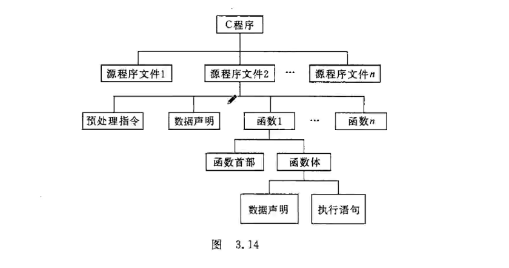
> 语句分类

1. 控制语句
  * if...else
  * switch...case
  * while...do
  * for...do
  * do...while
  * goto
  * return
  * continue
  * break
2. 函数调用语句
3. 表达式语句
4. 空语句
  * 只有一个分号没有其他东西
5. 复合语句
  * 语句块

1. 赋值语句

```c
s = （a+b）*c）
```
2. 符合的赋值运算语句
```c

a+=b;
s += （a+b）*c

```

3. 赋值表达式
  * 变量 赋值运算符 表达式
    * 赋值表达式 左侧为左值即它的值是可以改变的，出现在右边的为右值。凡是左值都可以作为右值

###  3.6. <a name='-1'></a>输入输出

1. 所谓输入输出是以计算机主机为主体而言
2. C语言本身不提供输入输出语句，由库函数提供

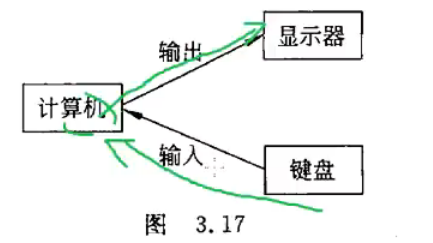

####  3.6.1. <a name='-1'></a>1. 基本输入输出函数

##### printf函数
- **功能**：格式化输出数据到标准输出设备（屏幕）
- **头文件**：`#include <stdio.h>`
- **基本语法**：`printf("格式控制字符串", 输出参数列表);`
  - 格式声明以及普通字符构成
  - 输出列表 变量常量表达式
- **常用格式说明符**：
  - `%d`：十进制整数
  - `%f`：浮点数
    - `%f` 默认输出6列小数
    - `%7.2f` 表示指定数据占7列，2表示小数占两列
  - `%c`：字符
  - `%s`：字符串
  - `%x`：十六进制数
  - `%o`：八进制数
  - `%u`：无符号整数

##### scanf函数
- **功能**：从标准输入设备（键盘）读取格式化输入
- **头文件**：`#include <stdio.h>`
- **基本语法**：`scanf("格式控制字符串", 地址参数列表);`
- **使用要点**：
  - 需要使用取地址符`&`获取变量地址（数组名除外）
  - 输入格式必须与格式说明符匹配

####  3.6.2. <a name='-1'></a>2. 其他输入输出函数

##### 字符输入输出
- **getchar()**：从标准输入读取一个字符
- **putchar()**：向标准输出写入一个字符

##### 字符串输入输出
- **gets()**：读取一行字符串（不推荐使用，存在安全风险）
- **puts()**：输出字符串并在末尾添加换行符

##### 格式化输入输出（字符串）
- **sprintf()**：格式化输出到字符串
- **sscanf()**：从字符串中读取格式化输入

####  3.6.3. <a name='-1'></a>3. 使用注意事项

- 所有输入输出函数都需要包含`stdio.h`头文件
- scanf函数需要使用地址符`&`获取变量地址
- printf和scanf的格式说明符必须与变量类型匹配
- 输入输出函数属于库函数，C语言本身不提供输入输出语句

##  4. <a name='-1'></a>选择结构和条件判断
 > 条件结构
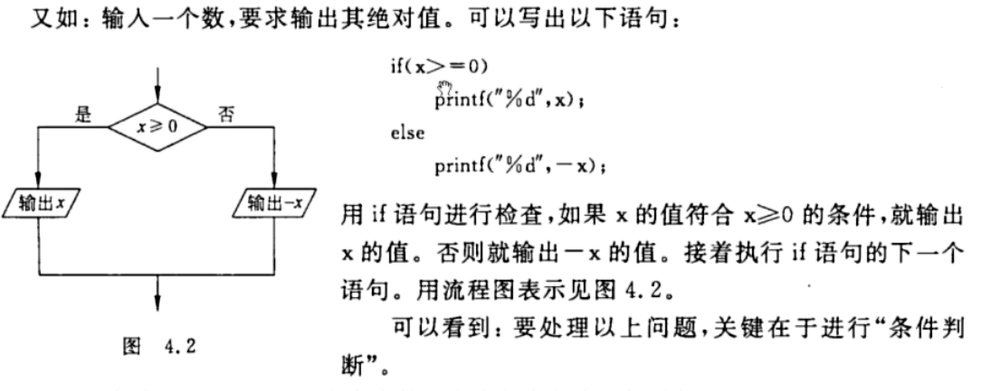

```c
if(condition)
{ 
    语句1;
}
else if(condition)
{
    语句2;
 }
else
{ 
    语句3;
}

switch(int/char)
{
    case 值1:
        语句1;
        break;
    case 值1:
        语句2;
        break;
    default:
        语句3;
        break;
//值必须为常量或常量表达式
}

```

###  4.1. <a name='-1'></a>条件运算符条件表达式

```c
max = a > b ? a : b;
// 表达式1 ? 表达式2 : 表达式3
// 若表达式1为真，则返回表达式2，否则返回表达式3
```

###  4.2. <a name='-1'></a>选择嵌套
```c
if(condition1)
  if(a > b)
    ;
  else
    ;
else
  if(a < b)
    ;
  else
    ;
```

##  5. <a name='-1'></a>循环结构

```c
while(condition)
{}

do
{
  ;
}while(condition);

for(init; condition; step)
{}

```

###  5.1. <a name='-1'></a>改变循环状态
```c
continue; //跳过本次循环
break;    //结束循环
```

##  6. <a name='-1'></a>利用数组处理批量数据

### 定义与引用一维数组

```c
/* 类型符 数组名[数组大小] */
int arr[10]

/* 
常量表达式 表示 数组大小 不能包含变量(不同标准支持变量做) 
c99 支持
*/

/* 引用 */
int a[5];


/* 初始化 */
int a[5] = {1,2,3,4,5};//顺序初始化
int a[5] = {1,2};      //初始化部分 未初始化的元素为0
int a[5] = {0,0,0,0,0}; //初始化所有元素为0
int a[5] = {0} //初始化所有元素为0
//可以不指定数组长度
int a[] = {1,2,3,4,5};

```

#### 数组存储方式

> 一维数组是连续存放的

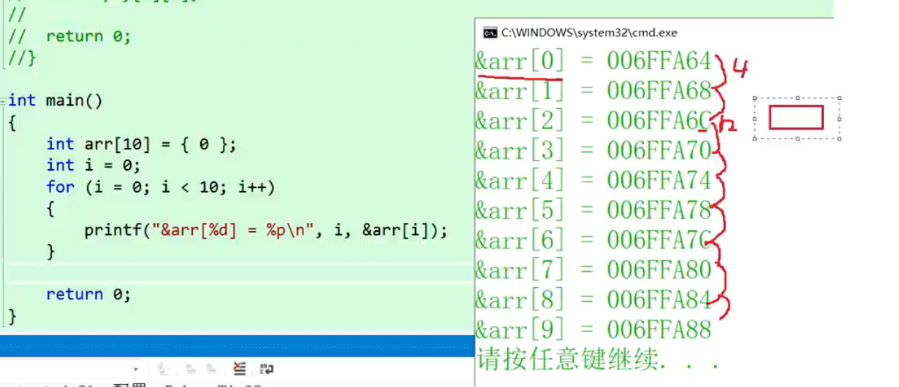


### 定义和引用二维数组

> 二维数组常称为 `矩阵` ，把二维数组写成 `行(column)` 和 `列(row)` 的排列形式，有助于理解二维数组的 `逻辑结构`

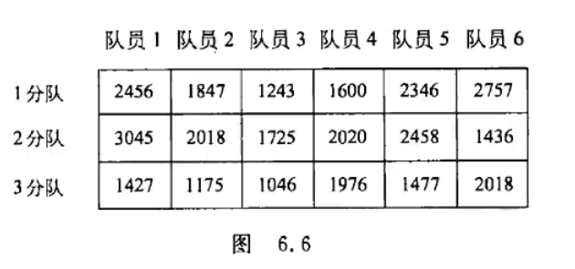

#### 定义
```c
/* 指定了行和列的数组 */
float a[3][4];

```


#### 引用 与 初始化
```c
int arr[3][4] = { {1, 2, 3, 4}, {5, 6, 7, 8}, {9, 10, 11, 12} };

/* 与一维数组初试化类似 */
/* 由于为行优先存储所以可以通过一维数组的方式访问 */
((int*)arr)[x] == arr[x/4][x%4]
*((int*)arr + x) == arr[x/4][x%4]

```


#### 二维数组的存储方式
1. 列优先存储


2. 行优先存储

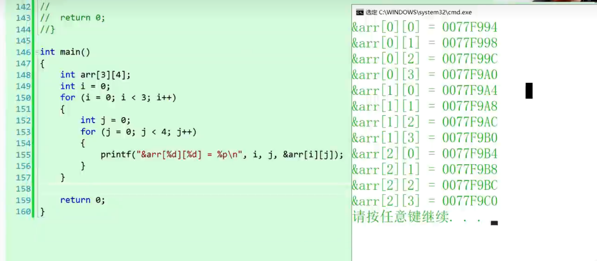

* 每行差 3*4 = 12 个字节 


### 字符数组


## [排序](./doc/sort.md)

##  7. <a name='-1'></a>关键字

[关键字](./doc/关键字.md)

##  8. <a name='-1'></a>附录

[附录](./doc/附录.md)
