<!-- vscode-markdown-toc -->
* 1. [程序设计与C语言](#C)
	* 1.1. [头文件与注释](#)
	* 1.2. [格式化输出说明](#-1)
	* 1.3. [常见转义字符](#-1)
	* 1.4. [比较操作示例](#-1)
	* 1.5. [使用 `scanf` 输入数据](#scanf)
	* 1.6. [C语言程序的基本结构](#C-1)
	* 1.7. [程序运行步骤](#-1)
	* 1.8. [程序设计任务](#-1)
	* 1.9. [注意事项](#-1)
* 2. [算法 程序灵魂](#-1)
	* 2.1. [什么是算法](#-1)
	* 2.2. [算法的特性](#-1)
	* 2.3. [怎样表示算法](#-1)
		* 2.3.1. [改善流程图弊端](#-1)
	* 2.4. [N-S结构化流程图](#N-S)
	* 2.5. [伪代码表示](#-1)
	* 2.6. [结构化程序设计方法](#-1)
* 3. [简单C程序设计 -- 顺序程序设计](#C--)
	* 3.1. [数据的表现形式及其运算](#-1)
	* 3.2. [数据类型](#-1)
		* 3.2.1. [1. 基本数据类型（Basic Data Types）](#BasicDataTypes)
		* 3.2.2. [2. 构造数据类型（Derived Data Types）](#DerivedDataTypes)
		* 3.2.3. [3. 指针类型（Pointer Types）](#PointerTypes)
		* 3.2.4. [4. 空类型（Void Type）](#VoidType)
		* 3.2.5. [5. 限定符（Type Qualifiers）](#TypeQualifiers)
		* 3.2.6. [格式化输出对应关系](#-1)
		* 3.2.7. [优先级与结和性](#-1)
	* 3.3. [不同数据类型的运算](#-1)
	* 3.4. [强类型转换](#-1)
	* 3.5. [C语句](#C-1)
	* 3.6. [输入输出](#-1)
		* 3.6.1. [1. 基本输入输出函数](#-1)
		* 3.6.2. [2. 其他输入输出函数](#-1)
		* 3.6.3. [3. 使用注意事项](#-1)
* 4. [选择结构和条件判断](#-1)
	* 4.1. [条件运算符条件表达式](#-1)
	* 4.2. [选择嵌套](#-1)
* 5. [循环结构](#-1)
	* 5.1. [改变循环状态](#-1)
* 6. [利用数组处理批量数据](#-1)
	* 6.1. [定义与引用一维数组](#-1)
		* 6.1.1. [数组存储方式](#-1)
	* 6.2. [定义和引用二维数组](#-1)
		* 6.2.1. [定义](#-1)
		* 6.2.2. [引用 与 初始化](#-1)
		* 6.2.3. [二维数组的存储方式](#-1)
	* 6.3. [字符数组](#-1)
		* 6.3.1. [C语言字符串处理](#C-1)
* 7. [函数](#-1)
	* 7.1. [为什么写函数](#-1)
	* 7.2. [函数定义](#-1)
	* 7.3. [如何定义函数](#-1)
	* 7.4. [函数调用](#-1)
	* 7.5. [函数调用时的数据传递](#-1)
	* 7.6. [函数调用过程](#-1)
	* 7.7. [对被调用函数的声明和函数原型](#-1)
	* 7.8. [函数嵌套调用](#-1)
	* 7.9. [递归 (Recursion)](#Recursion)
		* 7.9.1. [递归的基本要素](#-1)
		* 7.9.2. [递归示例](#-1)
		* 7.9.3. [递归与循环的比较](#-1)
		* 7.9.4. [递归的优缺点](#-1)
		* 7.9.5. [递归优化技术](#-1)
		* 7.9.6. [递归的应用场景](#-1)
		* 7.9.7. [注意事项](#-1)
		* 7.9.8. [尾递归优化](#-1)
	* 7.10. [数组作为函数传参](#-1)
		* 7.10.1. [多维数组名作函数参数](#-1)
		* 7.10.2. [注意](#-1)
* 8. [变量](#-1)
	* 8.1. [全局变量与局部变量](#-1)
	* 8.2. [变量的生存周期以及存储方式](#-1)
		* 8.2.1. [存储类型](#-1)
		* 8.2.2. [四区](#-1)
	* 8.3. [关于变量的声明和定义](#-1)
* 9. [指针](#-1)
	* 9.1. [指针是什么](#-1)
	* 9.2. [指针变量](#-1)
	* 9.3. [指针变量作为函数参数](#-1)
	* 9.4. [指针访问数组](#-1)
	* 9.5. [指针运算](#-1)
	* 9.6. [数组名做函数参数](#-1)
	* 9.7. [通过指针引用多维数组](#-1)
	* 9.8. [字符串的引用方式](#-1)
	* 9.9. [字符指针做函数参数](#-1)
	* 9.10. [使用字符指针变量和字符数组的比较](#-1)
	* 9.11. [指向函数的指针](#-1)
* 10. [[排序](./doc/sort.md)](#.docsort.md)
* 11. [[关键字](./doc/关键字.md)](#.doc.md)
* 12. [[附录](./doc/附录.md)](#.doc.md-1)
* 13. [[进制转换](./doc/进制转换.md)](#.doc.md-1)
* 14. [[变量数据类型问题](./doc/变量数据类型问题.md)](#.doc.md-1)

<!-- vscode-markdown-toc-config
	numbering=true
	autoSave=true
	/vscode-markdown-toc-config -->
<!-- /vscode-markdown-toc -->
# C语言学习笔记

##  1. <a name='C'></a>程序设计与C语言

```c
#include <stdio.h>      // 编译预处理指令

// int 表示返回类型
int main()              // 主函数 -- 程序入口
{
    // 要完成的功能
    printf("hello world\n"); // 函数调用
    return 0;                // 返回值为整数0
}
```

###  1.1. <a name=''></a>头文件与注释

- `#include`：包含/引用头文件
- `stdio.h`：标准输入输出头文件
- **注释方式**
  - `//`：单行注释
  - `/* ... */`：多行注释

###  1.2. <a name='-1'></a>格式化输出说明

| 数据类型 | 描述           |
| :------- | :------------- |
| `%d`     | 整数           |
| `%f`     | 浮点数         |
| `%lf`     | 长浮点数         |
| `%c`     | 字符           |
| `%s`     | 字符串         |
| `%%`     | 输出一个百分号 |
| `%x`     | 十六进制数     |
| `%o`     | 八进制数       |
| `%u`     | 无符号整数     |
| `%e`     | 指数表示法     |

###  1.3. <a name='-1'></a>常见转义字符

| 转义字符 | 描述         |
| :------- | :----------- |
| `\n`     | 换行         |
| `\t`     | 制表符       |
| `\r`     | 回车         |
| `\b`     | 退格         |
| `\f`     | 换页         |
| `\'`     | 单引号       |
| `\"`     | 双引号       |
| `\\`     | 反斜杠       |
| `\0`     | 空字符       |
| `\a`     | 响铃         |
| `\v`     | 垂直制表符   |

###  1.4. <a name='-1'></a>比较操作示例

```c
int compare() 
{
    int a = 10, b = 20;
    if (a > b) 
        printf("a > b\n");
    else if (a < b) 
        printf("a < b\n");

    return 0;
}
```

###  1.5. <a name='scanf'></a>使用 `scanf` 输入数据

```c
void use_scanf()
{
    int a = 0; // 如果没有赋值则为随机值
    int b = 0;

    /*
     * %d 表示要输入两个整型，加取址符号 & 表示存放的位置
     * 其中输入的格式必须和输出的格式一致
     * 输入的格式为：%d %d
     * 输入的数据为：10 20
     * 输入格式为：%d,%d
     * 输入数据为：10,20
     */
    scanf("%d %d", &a, &b); 
    compare(a, b);
}
```

###  1.6. <a name='C-1'></a>C语言程序的基本结构

1. 一个程序由一个或多个源程序文件组成。
   - 每个源文件包括三部分：
     - 预处理指令（如导入头文件、设置宏）
     - 全局声明（在函数定义之前声明变量）
     - 函数定义（需在调用前定义）

2. 函数是C语言的重要组成部分。
   - 

3. 一个函数包含两个主要部分：
   - **函数首部**
     - 
   - **函数体**
     - 声明部分（如 `int max(int a, int b);`）
     - 执行部分（具体操作语句）

4. 程序中的所有操作都是通过函数中的C语句执行的。

5. 每条语句末尾必须以分号 `;` 结尾。

6. C语言本身不提供输入输出语句；这些功能由库函数提供。

7. 程序应包含适当的注释以提高可读性和维护性。

###  1.7. <a name='-1'></a>程序运行步骤

1. 在上位机中编写并编辑源代码。
2. 对源程序进行编译。
    1. 预编译   --      预处理
    2. 编译     --      有无语法错误 形成目标程序 xx.obj
    3. 链接     --      链接多个目标程序形成可执行程序 xx.exe(由众多.obj文件)
3. 运行程序。
> 示意图


###  1.8. <a name='-1'></a>程序设计任务

1. 问题分析
2. 设计算法
3. 编写程序
4. 对源程序进行编辑，编译和链接
5. 运行程序，分析结果
6. 编写程序文档

###  1.9. <a name='-1'></a>注意事项

- 若声明变量但未初始化，则其值为随机值。
  ```c
  int a; // 值为随机
  ```

- `&` 是取地址运算符，用于获取变量的内存地址。

- 函数声明应在调用前完成，建议放在文件开头或头文件中。

- 一个工程可以包含多个源文件，它们之间可以相互调用函数。

- 一个工程中只能有一个 `main()` 函数。
  - CMake 编译时可以指定多个源文件参与编译。

##  2. <a name='-1'></a>算法 程序灵魂

1. 程序主要包含两方面信息
    1. 对数据描述
        1. 用到哪些数据
        2. 数据的组织形式
    2. 对操作的描述
        1. 所用配料
        2. 操作步骤

> 程序 = 算法 ＋ 数据结构；还需要结构化的程序设计方法

###  2.1. <a name='-1'></a>什么是算法

* 算法是解决 `做什么` 与 `怎么做`的问题

1. 算法分为两大类
    1. 数值运算
    2. 非数值运算

###  2.2. <a name='-1'></a>算法的特性

1. 有穷性
  1. 步骤是有限的，不能无限进行
2. 确定性
  1. 每个步骤都是确定的，不是含糊的，模棱两可
  2. 输入确定，输出也确定
3. 有零个或多个输入
4. 有一个或多个输出
5. 有效性

 

###  2.3. <a name='-1'></a>怎样表示算法

1. 自然语言表示
2. 流程图表示


> 例子


* 为了提高质量，必须限制箭头的滥用，不允许无规律的使流程随意转向，只能顺序的进行下去

####  2.3.1. <a name='-1'></a>改善流程图弊端

1. 三种基本结构
  1. 顺序`执行/结构`
  2. 选择`执行/结构`
  3. 重复`执行/结构`
    1. while
    2. until `do while`


###  2.4. <a name='N-S'></a>N-S结构化流程图


###  2.5. <a name='-1'></a>伪代码表示

> 介于自然语言与计算机语言


###  2.6. <a name='-1'></a>结构化程序设计方法

1. 自顶而下
2. 逐步细化
3. 模块化设计
4. 结构化编码


* 划分子模块注意模块的独立性，耦合性越少越好


##  3. <a name='C--'></a>简单C程序设计 -- 顺序程序设计

###  3.1. <a name='-1'></a>数据的表现形式及其运算

* 常量
  * 整型常量
  * 实型常量
    * 十进制小数:`123.456`
    * 指数表示法:`12.34e3`
    * 字符常量
* 变量
  * 先定义再应用
* 
* C语言规定标识符只能由字母，数字，下划线3种字符组成，且第一个字符必须为字母或下划线
> 常变量与常量区别：常量是值，常变量是变量

###  3.2. <a name='-1'></a>数据类型

> 对数据分配存储单元的安排，包括存储单元的长度以及数据的存储形式。不同的类型分配不同的长度和存储形式

####  3.2.1. <a name='BasicDataTypes'></a>1. 基本数据类型（Basic Data Types）

##### 整型（Integer Types）
| 类型 | 关键字 | 大小（通常） | 范围 |
|------|--------|-------------|------|
| 短整型 | `short` 或 `short int` | 2字节 | -32,768 到 32,767 |
| 整型 | `int` | 4字节 | -2,147,483,648 到 2,147,483,647 |
| 长整型 | `long` 或 `long int` | 4字节（32位）或8字节（64位） | 取决于平台 |
| 长长整型 | `long long` 或 `long long int` | 8字节 | -2^63 到 2^63-1 |

> int类型存储形式为补码
[源码，反码，补码](./doc/源码，反码，补码.md)

##### 字符型（Character Types）
| 类型 | 关键字 | 大小 | 范围 |
|------|--------|------|------|
| 字符型 | `char` | 1字节 | -128 到 127 或 0 到 255 |
| 无符号字符型 | `unsigned char` | 1字节 | 0 到 255 |

##### 浮点型（Floating-Point Types）
| 类型 | 关键字 | 大小 | 范围 | 精度 |
|------|--------|------|------|------|
| 单精度浮点型 | `float` | 4字节 | ±3.4E+38 | 6-7位小数 |
| 双精度浮点型 | `double` | 8字节 | ±1.7E+308 | 15-16位小数 |
| 长双精度浮点型 | `long double` | 10/12/16字节 | 取决于平台 | 取决于平台 |

##### 无符号整型（Unsigned Integer Types）
| 类型 | 关键字 | 大小 | 范围 |
|------|--------|------|------|
| 无符号短整型 | `unsigned short` | 2字节 | 0 到 65,535 |
| 无符号整型 | `unsigned int` 或 `unsigned` | 4字节 | 0 到 4,294,967,295 |
| 无符号长整型 | `unsigned long` | 4/8字节 | 0 到 2^32-1 或 2^64-1 |
| 无符号长长整型 | `unsigned long long` | 8字节 | 0 到 2^64-1 |

####  3.2.2. <a name='DerivedDataTypes'></a>2. 构造数据类型（Derived Data Types）

##### 数组（Array）
- 一组相同类型数据的集合
- 示例：`int arr[10];`

##### 结构体（Structure）
- 不同类型数据的集合
- 示例：
```c
struct Student {
    int id;
    char name[20];
    float score;
};
```

##### 共用体（Union）
- 共享内存的不同类型数据
- 示例：
```c
union Data {
    int i;
    float f;
    char str[20];
};
```

##### 枚举（Enumeration）
- 定义一组命名的整型常量
- 示例：
```c
enum Color {RED, GREEN, BLUE};
```

####  3.2.3. <a name='PointerTypes'></a>3. 指针类型（Pointer Types）
- 存储内存地址的类型
- 示例：
```c
int *ptr;        // 整型指针
char *str;       // 字符指针
void *vptr;      // 通用指针
```

####  3.2.4. <a name='VoidType'></a>4. 空类型（Void Type）
- `void` 表示无类型
- 常用于函数返回值或参数声明
- 示例：
```c
void function(void);  // 无参数无返回值函数
void *ptr;            // 通用指针
```

####  3.2.5. <a name='TypeQualifiers'></a>5. 限定符（Type Qualifiers）

##### const
- 声明常量，值不可修改
- 示例：`const int MAX = 100;`

##### volatile
- 告诉编译器该变量可能被意外改变
- 示例：`volatile int flag;`

##### restrict（C99）
- 用于指针，表示唯一访问该对象的方式
- 示例：`int *restrict ptr;`

####  3.2.6. <a name='-1'></a>格式化输出对应关系


| 数据类型 | 格式说明符 | 描述 |
|---------|-----------|------|
| int | `%d` | 整数 |
| float | `%f` | 浮点数 |
| char | `%c` | 字符 |
| char* | `%s` | 字符串 |
| int | `%x` | 十六进制数 |
| int | `%o` | 八进制数 |
| unsigned int | `%u` | 无符号整数 |
| float | `%e` | 指数表示法 |

> 注意：实际的数据类型大小可能因编译器和平台而异，可以使用`sizeof`运算符来获取特定平台上的大小。

####  3.2.7. <a name='-1'></a>优先级与结和性
在C语言中，运算符的优先级决定了表达式中各个运算符的计算顺序。以下是C语言中运算符的优先级列表，从高到低排列：

##### 运算符优先级表

| 优先级 | 运算符 | 描述 | 结合性 |
|--------|--------|------|--------|
| 1 | `()` `[]` `->` `.` | 函数调用、数组下标、结构体成员访问 | 从左到右 |
| 2 | `++` `--` `+` `-` `!` `~` `(type)` `*` `&` `sizeof` | 后缀/前缀自增自减、一元运算符、类型转换、取值、取地址、大小运算 | 从右到左 |
| 3 | `*` `/` `%` | 乘法、除法、取模 | 从左到右 |
| 4 | `+` `-` | 加法、减法 | 从左到右 |
| 5 | `<<` `>>` | 左移、右移 | 从左到右 |
| 6 | `<` `<=` `>` `>=` | 关系运算符 | 从左到右 |
| 7 | `==` `!=` | 相等运算符 | 从左到右 |
| 8 | `&` | 按位与 | 从左到右 |
| 9 | `^` | 按位异或 | 从左到右 |
| 10 | `|` | 按位或 | 从左到右 |
| 11 | `&&` | 逻辑与 | 从左到右 |
| 12 | `||` | 逻辑或 | 从左到右 |
| 13 | `?:` | 条件运算符 | 从右到左 |
| 14 | `=` `+=` `-=` `*=` `/=` `%=` `<<=` `>>=` `&=` `^=` `|=` | 赋值运算符 | 从右到左 |
| 15 | `,` | 逗号运算符 | 从左到右 |

##### 说明

1. **优先级**：数字越小，优先级越高
2. **结合性**：当表达式中出现相同优先级的运算符时，根据结合性决定计算顺序
3. **注意事项**：
   - 一元运算符（如 `++`、`--`、`&`、`*`）优先级高于二元运算符
   - 赋值运算符优先级较低，且结合性为从右到左
   - 逻辑运算符 `&&` 和 `||` 有短路特性

##### 示例

```c
int a = 5, b = 3, c = 2;
int result = a + b * c;     // 结果为 11，因为 * 优先级高于 +
int result2 = (a + b) * c;  // 结果为 16，使用括号改变优先级
```

记住这些优先级规则有助于正确理解和编写复杂的C语言表达式。在实际编程中，如果不确定运算符的优先级，可以使用括号来明确表达式的计算顺序。

###  3.3. <a name='-1'></a>不同数据类型的运算

1. +，-，*，/中运算符，C语言会自动将不同数据类型的值转换为相同数据类型进行运算。例如，如果a是int类型，b是float类型，那么a + b的结果是float类型。
2. 字符类型与整型类型的运算，C语言会自动将字符类型转换为整形类型进行运算。例如，char a = 'a'; int b = 1; a + b的结果是int类型。如果与 ***实型*** 运算则转换为double类型
3. 小写比大写字母在ASCII中大32，`a` 为97，`A`为65，`a`-`A`为32 （可以进行大小写转换）


###  3.4. <a name='-1'></a>强类型转换

```c
(double) a
(int) a
(float) a

/*
float double 转换 int 舍去小数部分 只保留整数部分
int 转 float double 23 -> 23.0然后保存
double 转 float 只取6-8位有效数字;不可以双精度大小超过float类型大小
char 赋值 int 转换ASCII码赋值整形
多字节整形 转换低字节 只将低字节赋值 发生截断

*/


//(类型名) (表达式)

``` 

###  3.5. <a name='C-1'></a>C语句

* 一个函数包含声明部分与执行部分，执行部分由语句组成，语句作用是计算机系统发出的操作指令，要求执行相应的操作。一个c语句经过编译后产生若干条机器指令。


> 语句分类

1. 控制语句
  * if...else
  * switch...case
  * while...do
  * for...do
  * do...while
  * goto
  * return
  * continue
  * break
2. 函数调用语句
3. 表达式语句
4. 空语句
  * 只有一个分号没有其他东西
5. 复合语句
  * 语句块

1. 赋值语句

```c
s = （a+b）*c）
```
2. 符合的赋值运算语句
```c

a+=b;
s += （a+b）*c

```

3. 赋值表达式
  * 变量 赋值运算符 表达式
    * 赋值表达式 左侧为左值即它的值是可以改变的，出现在右边的为右值。凡是左值都可以作为右值

###  3.6. <a name='-1'></a>输入输出

1. 所谓输入输出是以计算机主机为主体而言
2. C语言本身不提供输入输出语句，由库函数提供


####  3.6.1. <a name='-1'></a>1. 基本输入输出函数

##### printf函数
- **功能**：格式化输出数据到标准输出设备（屏幕）
- **头文件**：`#include <stdio.h>`
- **基本语法**：`printf("格式控制字符串", 输出参数列表);`
  - 格式声明以及普通字符构成
  - 输出列表 变量常量表达式
- **常用格式说明符**：
  - `%d`：十进制整数
  - `%f`：浮点数
    - `%f` 默认输出6列小数
    - `%7.2f` 表示指定数据占7列，2表示小数占两列
  - `%c`：字符
  - `%s`：字符串
  - `%x`：十六进制数
  - `%o`：八进制数
  - `%u`：无符号整数

##### scanf函数
- **功能**：从标准输入设备（键盘）读取格式化输入
- **头文件**：`#include <stdio.h>`
- **基本语法**：`scanf("格式控制字符串", 地址参数列表);`
- **使用要点**：
  - 需要使用取地址符`&`获取变量地址（数组名除外）
  - 输入格式必须与格式说明符匹配

####  3.6.2. <a name='-1'></a>2. 其他输入输出函数

##### 字符输入输出
- **getchar()**：从标准输入读取一个字符
- **putchar()**：向标准输出写入一个字符

##### 字符串输入输出
- **gets()**：读取一行字符串（不推荐使用，存在安全风险）
- **puts()**：输出字符串并在末尾添加换行符

##### 格式化输入输出（字符串）
- **sprintf()**：格式化输出到字符串
- **sscanf()**：从字符串中读取格式化输入

####  3.6.3. <a name='-1'></a>3. 使用注意事项

- 所有输入输出函数都需要包含`stdio.h`头文件
- scanf函数需要使用地址符`&`获取变量地址
- printf和scanf的格式说明符必须与变量类型匹配
- 输入输出函数属于库函数，C语言本身不提供输入输出语句

##  4. <a name='-1'></a>选择结构和条件判断
 > 条件结构


```c
if(condition)
{ 
    语句1;
}
else if(condition)
{
    语句2;
 }
else
{ 
    语句3;
}

switch(int/char)
{
    case 值1:
        语句1;
        break;
    case 值1:
        语句2;
        break;
    default:
        语句3;
        break;
//值必须为常量或常量表达式
}

```

###  4.1. <a name='-1'></a>条件运算符条件表达式

```c
max = a > b ? a : b;
// 表达式1 ? 表达式2 : 表达式3
// 若表达式1为真，则返回表达式2，否则返回表达式3
```

###  4.2. <a name='-1'></a>选择嵌套
```c
if(condition1)
  if(a > b)
    ;
  else
    ;
else
  if(a < b)
    ;
  else
    ;
```

##  5. <a name='-1'></a>循环结构

```c
while(condition)
{}

do
{
  ;
}while(condition);

for(init; condition; step)
{}

```

###  5.1. <a name='-1'></a>改变循环状态
```c
continue; //跳过本次循环
break;    //结束循环
```

##  6. <a name='-1'></a>利用数组处理批量数据

###  6.1. <a name='-1'></a>定义与引用一维数组

```c
/* 类型符 数组名[数组大小] */
int arr[10]

/* 
常量表达式 表示 数组大小 不能包含变量(不同标准支持变量做) 
c99 支持
*/

/* 引用 */
int a[5];


/* 初始化 */
int a[5] = {1,2,3,4,5};//顺序初始化
int a[5] = {1,2};      //初始化部分 未初始化的元素为0
int a[5] = {0,0,0,0,0}; //初始化所有元素为0
int a[5] = {0} //初始化所有元素为0
//可以不指定数组长度
int a[] = {1,2,3,4,5};

```

####  6.1.1. <a name='-1'></a>数组存储方式

> 一维数组是连续存放的


###  6.2. <a name='-1'></a>定义和引用二维数组

> 二维数组常称为 `矩阵` ，把二维数组写成 `行(column)` 和 `列(row)` 的排列形式，有助于理解二维数组的 `逻辑结构`


####  6.2.1. <a name='-1'></a>定义
```c
/* 指定了行和列的数组 */
float a[3][4];

```


####  6.2.2. <a name='-1'></a>引用 与 初始化
```c
int arr[3][4] = { {1, 2, 3, 4}, {5, 6, 7, 8}, {9, 10, 11, 12} };

/* 与一维数组初试化类似 */
/* 由于为行优先存储所以可以通过一维数组的方式访问 */
((int*)arr)[x] == arr[x/4][x%4]
*((int*)arr + x) == arr[x/4][x%4]

```

####  6.2.3. <a name='-1'></a>二维数组的存储方式
1. 列优先存储

2. 行优先存储


* 每行差 3*4 = 12 个字节 

###  6.3. <a name='-1'></a>字符数组

* c语言中没有字符串类型，字符串存放在字符数组中

```c
/* 定义字符数组 字符结尾以/0 结束 */
char c[10];

```

> 初始化形式

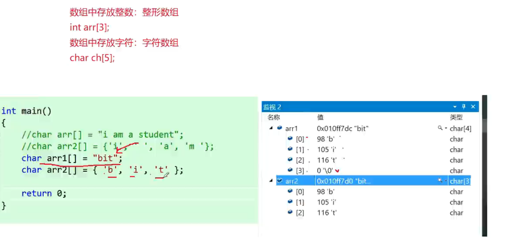

> 输出结果


* 其自动初始化以 `\0` 结束 


####  6.3.1. <a name='C-1'></a>C语言字符串处理

##### 字符串基础概念
```c
// 双引号引起的为字符串，以\0结束
char str[] = "as";  // 等价于 {'a', 's', '\0'}
```

##### 常用字符串处理函数

###### 1. 字符串输入输出
```c
// 字符串输入
char str1[10], str2[10], str3[10];
scanf("%s%s%s", str1, str2, str3);  // 以空格分隔读取
gets(str1);  // 读取整行（不推荐，有安全风险）

// 字符串输出
puts(str1);  // 输出字符串并在末尾添加换行符
```

###### 2. 字符串操作函数
```c
#include <string.h>

// 字符串连接
strcat(str1, str2);        // 将str2连接到str1末尾
strncat(str1, str2, 5);    // 连接指定长度

// 字符串复制
strcpy(str1, str2);        // 将str2复制到str1
strncpy(str1, str2, 5);    // 复制指定长度

// 字符串比较
strcmp(str1, str2);        // 比较字符串内容
strncmp(str1, str2, 5);    // 比较指定长度
```

###### 3. 字符串长度
```c
// 获取字符串长度（不包含\0）
int len = strlen(str);     // 返回size_t类型（无符号整数）
```

###### 4. strlwr & strupr
```c
strlwr(str); // 大写转小写

strupr(str); // 小写转大写

```

###### 5. gets()
```c
char str[100];

gets(str);

```

> 获取单词个数

* 程序逻辑

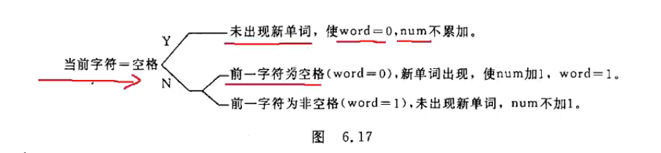


```c
int word = 0;
int num = 0;
int i = 0;


while (str6[i] != '\0')
{   
  if (str6[i] != ' ')
  {
    if (i == 0)
    {
      //首单词前面没有单词
      num++;
    }
    else if(str6[i-1] == ' ')
    {
      // 此时是单词 但前一个是空格
      num++;
    }
  }
  i++;
}


while (str6[i] != '\0')
{
    
  if(str6[i] == ' ')
  {
    word = 0;
  }
  else if(str6[i]!=' ' && word == 0)
  {
      word = 1;
      num++;
  }
  i++;
}

```


##### 字符串比较注意事项

###### 正确的字符串内容比较方式：
```c
char str1[] = "abc";
char str2[] = "abd";

// 使用strcmp函数比较字符串内容
if (strcmp(str1, str2) > 0) {
    printf("str1 > str2 (按字典序)\n");
} else if (strcmp(str1, str2) < 0) {
    printf("str1 < str2 (按字典序)\n");
} else {
    printf("str1 == str2\n");
}
```

###### 错误的比较方式：
```c
// 直接使用 > < == 比较的是数组首地址，不是字符串内容
if (str1 > str2) {
    printf("比较的是数组首元素的地址，不是字符串内容\n");
}
```

###### 常见陷阱与注意事项

1. **字符串长度比较陷阱**：
```c
char str1[] = "abc";   // 长度为3
char str2[] = "abcd";  // 长度为4

// strlen返回无符号整数，可能导致意外结果
if (strlen(str1) - strlen(str2) > 0) {
    // 这里会得到非预期结果，因为无符号数的特性
}
```

2. **字符串初始化区别**：
```c
char str1[] = {'a', 'b', 'c'};  // 没有\0结束符
char str2[] = "abc";            // 有\0结束符，长度为3
```

###### 总结

- C语言中字符串以字符数组形式存储，以`\0`为结束标志
- 字符串内容比较应使用`strcmp`函数，而非直接使用比较运算符
- 直接使用比较运算符（如`>`、`<`）比较的是数组首地址，不是字符串内容
- 使用字符串处理函数时需要包含`<string.h>`头文件
- 注意`strlen`返回的是`size_t`类型（无符号整数），在进行算术运算时要特别小心


##  7. <a name='-1'></a>函数

###  7.1. <a name='-1'></a>为什么写函数

* 使得程序维护简单，使得程序不会过于冗余，变得精炼
* 使用模块化编程的思路


###  7.2. <a name='-1'></a>函数定义

> 函数声明

```c
void fuction();
```

> 函数调用

```c
function();
```

> 函数定义

```c
/*
分为库函数以及自定义函数
分为 无参函数以及有参函数

*/


void function()
{
  printf("hello world");
}
```

###  7.3. <a name='-1'></a>如何定义函数

* 指定函数的名字，以便以后按名调用
* 指定函数的类型，即函数返回值的类型
* 指定函数的参数的名字和类型，以便调用函数时传入参数，对于无参函数不需要指定
* 指定函数应该完成什么操作，也就是函数是做什么的，函数的功能

```C
void function(void) // 明确指明没有参数，编译出错

void function()   // 默认无参，传参无影响

void function(int a, int b) // 默认参数类型是int 
```

###  7.4. <a name='-1'></a>函数调用

1. 函数调用语句
```c
function();
```
2. 函数表达式

```c
int a = function(a, b);
```

3. 函数作为参数

```c
function(a, function(a, b));

```

###  7.5. <a name='-1'></a>函数调用时的数据传递

1. 形参和实参
  1. 形参： 函数定义时候的参数名称
  2. 实参：函数调用时传入的参数名称；可以是常量，变量，表达式，函数
2. 实参与形参的数据传递
  1. 系统会把实参的值传递给被调用函数的形参。该值在函数调用期间有效 `虚实结合`

###  7.6. <a name='-1'></a>函数调用过程

1. 在定义函数中指定的形参，在未出现函数调用时，他们并不占内存的存储单元。发生函数调用时，函数的形参被临时分配内存单元
  1. `值传递`：实参传递给形参后，形参是实参的一份临时copy，对形参的修改不会影响实参
  2. `引用传递`：实参传递给形参后，形参和实参共用一个内存单元，对形参的修改会影响实参；传递指针
2. 将实参对应的值传递给 形参
3. 可以通过return语句返回给调用者
  1. 可以带会值
  2. 可以不带返回值
4. 函数调用结束后，形参所占的内存单元被释放
5. 定义函数时指定的函数类型一般应该和 `return` 语句中的表达式类型一致

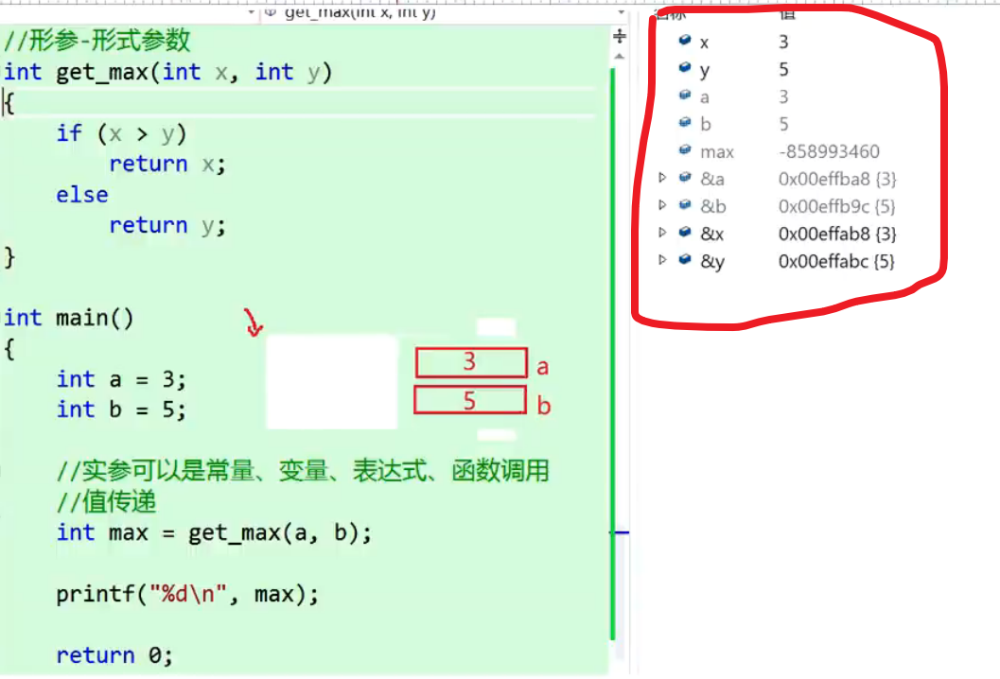


###  7.7. <a name='-1'></a>对被调用函数的声明和函数原型

1. 在使用之前声明
2. 对于库函数需要 `#include <algorithm>`

###  7.8. <a name='-1'></a>函数嵌套调用

```c
void f(int a) {

  f(a);
}

```

###  7.9. <a name='Recursion'></a>递归 (Recursion)

递归是一种重要的编程技术，函数直接或间接地调用自身来解决问题。递归将复杂问题分解为相似但规模更小的子问题。

####  7.9.1. <a name='-1'></a>递归的基本要素

1. **基础情况(Base Case)**：递归的终止条件，防止无限递归
2. **递归情况(Recursive Case)**：函数调用自身，处理规模更小的问题

####  7.9.2. <a name='-1'></a>递归示例

##### 1. 计算阶乘
```c
#include <stdio.h>

// 递归计算阶乘
int factorial(int n) {
    // 基础情况
    if (n <= 1) {
        return 1;
    }
    // 递归情况
    return n * factorial(n - 1);
}

int main() {
    int n = 5;
    printf("%d! = %d\n", n, factorial(n));
    return 0;
}
```

##### 2. 斐波那契数列
```c
#include <stdio.h>

// 递归计算斐波那契数列
int fibonacci(int n) {
    // 基础情况
    if (n <= 1) {
        return n;
    }
    // 递归情况
    return fibonacci(n - 1) + fibonacci(n - 2);
}

int main() {
    for (int i = 0; i < 10; i++) {
        printf("%d ", fibonacci(i));
    }
    printf("\n");
    return 0;
}
```

##### 3. 汉诺塔问题
```c
#include <stdio.h>

// 递归解决汉诺塔问题
void hanoi(int n, char from, char aux, char to) {
    // 基础情况
    if (n == 1) {
        printf("Move disk 1 from %c to %c\n", from, to);
        return;
    }
    // 递归情况
    // 将前n-1个盘子从from移动到aux
    hanoi(n - 1, from, to, aux);
    // 将第n个盘子从from移动到to
    printf("Move disk %d from %c to %c\n", n, from, to);
    // 将n-1个盘子从aux移动到to
    hanoi(n - 1, aux, from, to);
}

int main() {
    int n = 3;
    hanoi(n, 'A', 'B', 'C');
    return 0;
}
```

####  7.9.3. <a name='-1'></a>递归与循环的比较

##### 使用循环计算阶乘
```c
int factorial_iterative(int n) {
    int result = 1;
    for (int i = 1; i <= n; i++) {
        result *= i;
    }
    return result;
}
```

##### 使用递归计算阶乘
```c
int factorial_recursive(int n) {
    if (n <= 1) {
        return 1;
    }
    return n * factorial_recursive(n - 1);
}
```

####  7.9.4. <a name='-1'></a>递归的优缺点

##### 优点
- 代码简洁，易于理解
- 自然地表达问题的递归结构
- 适合处理树形结构、分治算法等问题

##### 缺点
- 可能导致大量重复计算
- 占用较多内存（函数调用栈）
- 可能出现栈溢出

####  7.9.5. <a name='-1'></a>递归优化技术

##### 1. 记忆化递归（Memoization）
```c
#include <stdio.h>
#include <string.h>

// 使用记忆化优化斐波那契计算
int memo[100];

int fibonacci_memo(int n) {
    if (n <= 1) {
        return n;
    }
    
    // 如果已经计算过，直接返回结果
    if (memo[n] != -1) {
        return memo[n];
    }
    
    // 计算并存储结果
    memo[n] = fibonacci_memo(n - 1) + fibonacci_memo(n - 2);
    return memo[n];
}

int main() {
    // 初始化记忆数组
    memset(memo, -1, sizeof(memo));
    
    for (int i = 0; i < 10; i++) {
        printf("%d ", fibonacci_memo(i));
    }
    printf("\n");
    return 0;
}
```

####  7.9.6. <a name='-1'></a>递归的应用场景

1. **数学计算**：阶乘、斐波那契数列、组合数学等
2. **树和图遍历**：二叉树遍历、图的深度优先搜索等
3. **分治算法**：快速排序、归并排序、二分查找等
4. **回溯算法**：八皇后问题、迷宫求解等
5. **动态规划**：某些DP问题的递归实现

####  7.9.7. <a name='-1'></a>注意事项

1. 必须有明确的基础情况，否则会导致无限递归
2. 递归深度不宜过大，防止栈溢出
3. 注意重复计算问题，必要时使用记忆化
4. 对于简单问题，迭代可能比递归更高效

####  7.9.8. <a name='-1'></a>尾递归优化

尾递归是一种特殊的递归形式，递归调用是函数的最后一个操作：

```c
// 普通递归
int factorial(int n) {
    if (n <= 1) return 1;
    return n * factorial(n - 1);  // 不是尾递归，因为还有乘法操作
}

// 尾递归版本
int factorial_tail(int n, int acc) {
    if (n <= 1) return acc;
    return factorial_tail(n - 1, n * acc);  // 尾递归
}

int factorial_optimized(int n) {
    return factorial_tail(n, 1);
}
```

* 尾递归可以被编译器优化为循环，避免栈溢出问题。

###  7.10. <a name='-1'></a>数组作为函数传参

1. 数组元素作为实参时，向形参变量传递的是数组元素的值，而使用数组名做函数实参时，向形参（数组名或指针变量）传递的是数组首元素的地址。
2. 函数内对数组的修改会反映到调用者中。
3. 主调函数和被调函数分别定义数组
4. 实参数组与形参数组类型一致
5. 在形参中声明的数组大小不起作用 `arr[10]` 其中10不起作用只是将实参数组的首元素地址传递给形参数组名
6. 形参数组可以不指定大小，在定义数组后面跟一个空的方括号

```c
float sum(float arr[], int n) {}
```

####  7.10.1. <a name='-1'></a>多维数组名作函数参数

1. 可以使用多维数组名作为函数的实参和形参，在被调用函数中对形参数组定义时可以指定每一维的数组大小，也可以省略第一维的大小说明例如
  1. `void func(int arr[10][5])`
  2. `void func(int arr[][5])`
2. 二维数组是由若干个一维数组组成的，在内存中，数组是按行存放的，因此，在定义二维数组的时候，必须指定列数（一行中包含几个元素），由于形参数组与实参数组类型相同，所以他们是由具有相同长度的一维数组所组成

####  7.10.2. <a name='-1'></a>注意
```c
void func(int arr[]) {
    // 这里 sizeof(arr) 返回的是指针大小（通常是 4 或 8 字节），而不是数组大小
}

int main() {
    int arr[10];
    sizeof(arr);  // 正确：返回数组大小
    func(arr);
    return 0;
}
```

##  8. <a name='-1'></a>变量

###  8.1. <a name='-1'></a>全局变量与局部变量

1. 局部变量定义：局部变量定义在函数内，其生命周期只在函数内。
  1. 函数开头定义
  2. 函数内的复合语句定义
2. 全局变量定义：全局变量定义在函数外，其生命周期是程序的整个生命周期。
  1. 函数的外部定义

> 局部变量定义

```c
/*
主函数中定义的变量也只在主函数中有效
不同函数中可以使用同名的变量，他们代表不同的对象；互不干扰
形式参数也是局部变量
一个函数内部，可以在复合语句中定义变量，这些变量只在本复合语句中有效，这种复合语句也成为 `分程序` 或  `程序块`
*/


int val = 100;

void test()
{
  int b = 20; // 局部变量
  for (int i = 0; i < 10; i++) {
    int a = 10; // 局部变量
  }

}
```

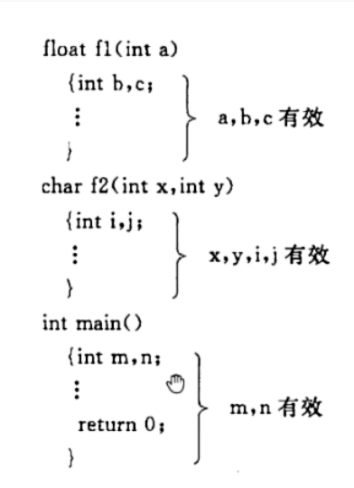

> 全局变量

1. 函数外定义的变量称为 `外部变量`，外部变量是 `全局变量`；全局变量可以为本文件中其他函数所用。有效范围从定义变量的位置开始到本源文件结束

###  8.2. <a name='-1'></a>变量的生存周期以及存储方式
####  8.2.1. <a name='-1'></a>存储类型

1. auto   自动的
2. static 静态的
3. register 寄存器的
4. extern   外部的


##### auto

1. 局部变量

```c
int main()
{
  auto int a; // 局部变量 自动销毁

}

```
2. 关键字 `auto` 可以省略 不写auto 隐含指定为 `自动存储类别`

##### static 静态的存储类型

1. 静态局部变量属于静态存储类型，在静态存储区内分配存储单元。在程序运行期间不释放
2. 对于静态局部变量是在编译时赋初值，即只赋值一次，在程序运行时它已有初值。以后每次调用时不再重新赋初值而是保留上次函数调用结束时的值。
3. 对于局部变量时不赋初值的话，对于静态局部变量来说，编译器自动赋初值，0 或者 '\0'
4. 静态局部变量在函数内定义，只有本函数内可以引用

```c
void test()
{
  static int a =  1;
  a++;
  printf("%d\n", a);
}

int main()
{
  for (int i = 0; i < 10; i++) {
    test(); //2 3 4 5 6 7 8 9 10
  }
}
```
##### register 寄存器变量

1. 重复大量使用的变量建议放在寄存器里面

```c
int main()
{
  int a = 10;
  rejister int  b = 10 ; //建议存放在寄存器里面
}


```

##### 全局变量存储类型

1. 静态存储区（Static Storage Area）,生产周期是固定的，存在于程序的整个生命周期，程序运行结束，静态变量就会消失
2. 从变量定义处开始到本程序文件末尾，在此作用域内，全局变量可以为各个函数所引用。
3. 可以扩展为外部变量
  1. 在一个文件内扩展外部变量的作用域 -- `extern int a;`
  2. 在一个文件外扩展外部变量的作用域 -- `extern int a;`
  3. 将外部变量的作用域限制在本文件中 -- `static int a;`
> 文件外扩展

```c
// file1.c
int global_var = 100;

// file2.c
#include <stdio.h>
extern int global_var;  // 声明使用其他文件中的变量

int main() {
    printf("外部变量值: %d\n", global_var);
    return 0;
}
```

> 文件内扩展

```c
extern int global_var;

int main() {

    printf("外部变量值: %d\n", global_var);
    return 0;

}

int global_var = 100; 

```

> 将变量作用域限制在本文件中

```c

/* 
1. 对于局部变量使用static 声明 ，将他分配在静态存储区，该变量在整个程序执行期间不释放
2. 对于全局变量使用static 声明 ， 变量作用域只限于本文件模块

*/
static int global_var = 100;
```


####  8.2.2. <a name='-1'></a>四区

##### 1. 静态存储区（Static Storage Area）

- **特点**：程序编译时分配，程序结束时释放
- **存储内容**：
  - 全局变量
  - 静态变量（static修饰的变量）
  - 字符串常量
- **生命周期**：整个程序运行期间
- **示例**：
```c
int global_var = 10;        // 全局变量，存储在静态区
static int static_var = 20; // 静态变量，存储在静态区

int main() {
    static int local_static = 30; // 局部静态变量，也存储在静态区
    return 0;
}
```

##### 2. 程序区（Code Area）

- **特点**：存放程序的机器指令
- **存储内容**：
  - 程序的可执行代码
  - 函数的机器指令
- **访问方式**：CPU直接读取执行
- **保护机制**：通常设置为只读，防止被意外修改

##### 3. 堆区（Heap Area）

- **特点**：动态分配，程序员手动管理
- **分配方式**：使用 `malloc`、`calloc`、`realloc` 等函数分配
- **释放方式**：使用 `free` 函数释放
- **生命周期**：从分配到释放的期间
- **示例**：
```c
int *ptr = (int*)malloc(sizeof(int) * 10); // 在堆区分配内存
// 使用ptr指向的内存
free(ptr); // 释放堆区内存
```

##### 4. 栈区（Stack Area）

- **特点**：自动分配和释放，速度快
- **存储内容**：
  - 局部变量
  - 函数参数
  - 函数调用时的返回地址
- **生命周期**：函数调用开始到函数结束
- **管理方式**：由编译器自动管理
- **示例**：
```c
void function(int param) {  // param存储在栈区
    int local_var = 10;     // local_var存储在栈区
    // 函数结束时，local_var和param自动释放
}
```

##### 四区的特点对比

| 区域 | 分配时间 | 释放时间 | 管理方式 | 速度 | 大小限制 |
|------|----------|----------|----------|------|----------|
| 静态存储区 | 编译时 | 程序结束 | 系统自动 | 中等 | 较大 |
| 程序区 | 编译时 | 程序结束 | 系统自动 | 最快 | 固定 |
| 堆区 | 运行时 | 程序员控制 | 程序员手动 | 较慢 | 受系统限制 |
| 栈区 | 运行时 | 自动 | 系统自动 | 最快 | 有限（通常几MB） |

##### 内存管理注意事项

1. **栈区溢出**：递归过深或局部变量过大可能导致栈溢出
2. **堆区内存泄漏**：分配的堆内存必须手动释放
3. **野指针**：释放堆内存后应将指针置为NULL
4. **内存碎片**：频繁的堆内存分配和释放可能导致内存碎片

* 这些内存区域的合理使用是编写高效、安全C程序的基础。


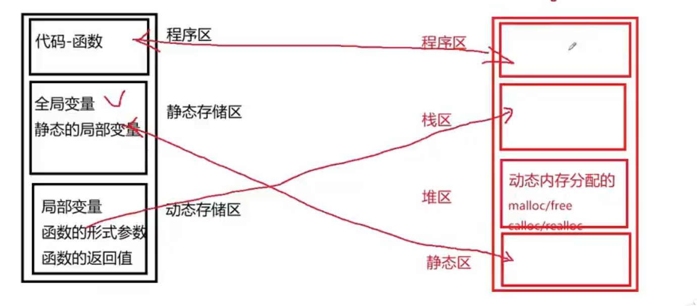

###  8.3. <a name='-1'></a>关于变量的声明和定义

1. 一种是需要建立存储空间     ： 定义声明
2. 一种是不需要建立存储空间    ： 引用性声明

* 建立存储空间的声明称为定义； 不需要建立存储空间的声明称为声明

```c
int a; //建立存储空间
extern int b; //引用性声明

```
1. 外部变量的定义只能有一次，它的位置在所有函数之外。
2. 在同一文件中，可以有多次对外部变量的声明，它的位置可以在函数之内（哪个函数需要就在哪个函数中声明），也可以在函数之外。（在外部变量的定义点之前）
3. 系统根据外部变量的定义（而不是根据外部变量的声明）分配存储单元。

```c
//file1.c

//内部函数 只能在自身文件使用

static div (int a, int b)
{
  return a / b;
}

//外部函数
int Add(int a, int b)
{
  return a + b;
}

//file2.c

extern int Add(int,int);

int main()
{
  int a = 10, b = 20;
  printf("%d\n",Add(a,b));

  return 0;
}

```

##  9. <a name='-1'></a>指针

###  9.1. <a name='-1'></a>指针是什么

1. 地址指向该变量单元
2. 存储变量地址
3. 存储单元的地址和存储单元的内容是两个概念
4. 指向就是通过地址来体现的
5. 一个变量的地址称为该变量的指针

```c
/* 直接访问 */
int a = 10;
a；

/* 间接访问 */
int *p;  // 指针变量，存放地址的变量
p = &a;
*p;

/* 指向同一组数据 */
int a = 10;
int *p = &a;
a;//10
*p = 20;
a;//20
```

###  9.2. <a name='-1'></a>指针变量

1. 指针变量前面的 `*` 表示该变量类型是指针类型
2. 在定义指针变量时必须指定 `基类型`
3. 一个变量指针的含义包含两个方面
  1. 存储单元编号
  2. 指向的存储单元的数据类型
4. 指针变量只能存放指针
5. 指针变量的大小 `4/8` 字节，与计算机系统架构相同


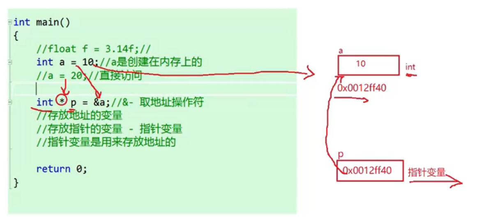


###  9.3. <a name='-1'></a>指针变量作为函数参数

* 实参传给形参时候，形参是实参的一份临时拷贝，对形参的修改不会影响实参
* 指针作为函数参数作用是将一个变量的地址传送到另一个函数中

```c
/*
@breif 交换两个数值
@param num1, num2
@return void
*/
void swap_int(int *num1, int *num2)
{
    int temp = *num1;
    *num1 = *num2;
    *num2 = temp;
}

```

###  9.4. <a name='-1'></a>指针访问数组

1. 数组元素的指针就是数组元素的地址
2. 引用数组元素可以用下标法 `a[3]` 也可以用 `指针法`
  1. 指针法访问更快，占用内存更小

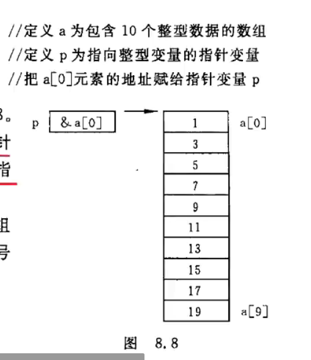

```c
int a[5] = {1,2,3,4,5};
/*
a[0] 数据
&a[0] 地址
arr == &a[0]
*/
int *p = &a[0]
//int *p = a; 等价
```
###  9.5. <a name='-1'></a>指针运算
1. p++
2. p--
3. p1+p2
4. p1-p2
  1. 两个指针相减，返回两个指针之间的元素个数（地址差/数组元素的长度）

> int *p;

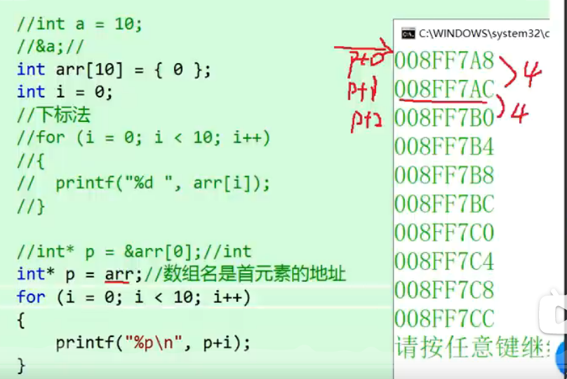

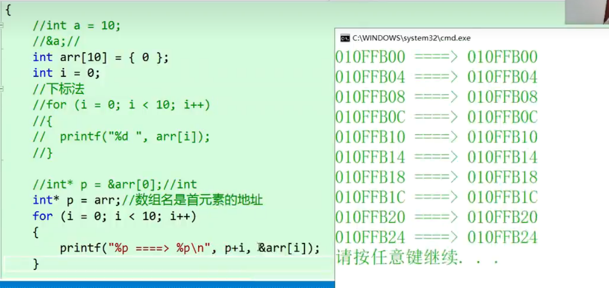

```c
void pointer_test()
{
    print_horizontal_line(20);
    printf("指针测试\n");
    int arr[5] = {1, 2, 3, 4, 5};
    int *p = arr;

    for (int i = 0; i < 5; i++)
    {
        printf("%p ====> %p \n",p+i,&arr[i]);
        printf("%d ====> %d \n",*(p+i),arr[i]);
    }
    
}
```

> 访问数组元素的三种写法

1. 下标法与运算符法等效；都是c编译系统将a[i]转换为 *(a+i)处理，先计算元素地址
2. 指针法更快，用指针变量指向元素，不必每次都重新计算地址
3. 下标法更加显式，可读性更好

```c
int arr[5] = {1,2,3,4,5};
int *p = arr;

/* 下标法 */
for (int i = 0; i < 5; i++)
{
  printf("%d\n",arr[i]);
}

/* 指针法 */
for (int i = 0; i < 5; i++)
{
  printf("%d\n",*(p+i));
}

/* 运算符法 */
for (int i = 0; i < 5; i++)
{
  printf("%d\n",*(arr+i));
}

```

###  9.6. <a name='-1'></a>数组名做函数参数

1. `fun(int arr[])`
2. `fun(int *arr)`

* 两者是等价写法

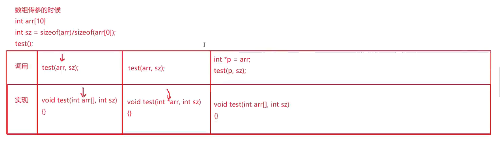

###  9.7. <a name='-1'></a>通过指针引用多维数组

1. 多维数组地址
  1. int a[3][4]
    1. 行列
2. 从二维数组角度来看，a代表二维数组首元素的地址，而此时的首元素不是一个简单的整形元素。而是由4个整形元素组成的一个结构体。因此，若a的首行地址为2000，则a+1 应该等于 2000 + sizeof(a[0]) 其中a[0]为一行元素的所占内存大小。
3. 指向数组元素的指针变量 `int *p = &arr[0][0]` / `int *p = arr[0]`
4. 指向由m个元素组成的一维数组 (数组指针)  `int (*p)[4] = arr` 


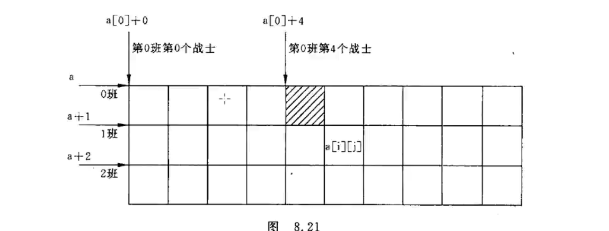

```c
int arr[3][4] = { {1, 2, 3, 4}, {5, 6, 7, 8}, {9, 10, 11, 12} };

/* 与一维数组初试化类似 */
/* 由于为行优先存储所以可以通过一维数组的方式访问 */
((int*)arr)[x] == arr[x/4][x%4]
*((int*)arr + x) == arr[x/4][x%4]

```
> 输出二维数组的有关数据(地址和值)

1. a[0],a[1],a[2]的类型为int*(指向整型变量)
2. a的类型为int (*)[4],指向含有四个元素的一维数组
```c
/*
这个例子展示了二维数组的指针表示法与下标表示法的等价性：

a[i][j] 等价于 *(*(a+i)+j)
a[i] 等价于 *(a+i)
行地址和该行首元素地址在数值上相同，但类型不同
*/

void print_addreess_two_array()
{
    int a[3][4] = {1,2,3,4,5,6,7,8,9,10,11,12};
    printf("%d,%d\n",a,*a);         //0行的首地址和0行0列元素地址
    printf("%d,%d\n",a[0],*(a+0));  //0行0列元素地址
    printf("%d,%d\n",&a[0],&a[0][0]);//0行首地址和0行0列元素地址
    printf("%d,%d\n",a[1],a+1);     //1行0列元素地址和1行首地址
    printf("%d,%d\n",&a[1][0],*(a+1)+0);    //1行0列元素地址
    printf("%d,%d\n",a[2],*(a+2));      //2行0列元素地值
    printf("%d,%d\n",&a[2],a+2);
}
```

> 二维数组形式

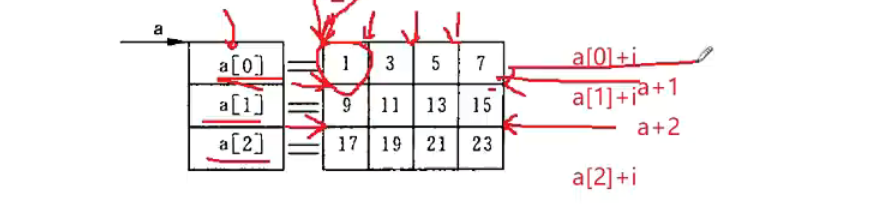

###  9.8. <a name='-1'></a>字符串的引用方式

1. 用字符数组存放一个字符串，可以通过数组名和下标引用字符串的一个字符，也可以通过数组名和格式声明 `%s` 输出该字符串
2. 用字符指针变量指向一个字符串常量，可以通过字符指针变量引用字符串常量
3. c语言对字符常量是按照字符数组处理的，在内存中开辟了一个字符数组用来存放字符串常量，但是这个字符数组是没有名字的，因此不能通过数组名来引用，只能通过指针变量来引用。对字符指针变量str初始化，实际上是把字符串第一个元素的地址赋给指针变量str，使得str指向字符串的第一个字符

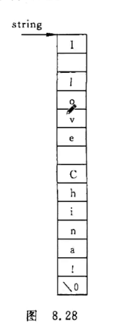

```c

char str[] = "hello world";
printf("%s",str);
printf("%c",str[6]); // 下标引用

```

###  9.9. <a name='-1'></a>字符指针做函数参数

> 传参字符串时候

1. 地址传递
2. 字符数组名传递
3. 字符指针传递

> 字符串复制

1. `\0` 等于 0 也为 逻辑否

```c
void copy_string(char *from, char *to)
{
  while(*to++ = *from++)
  {
    ;
  }
}

```

###  9.10. <a name='-1'></a>使用字符指针变量和字符数组的比较

1. 字符数组由若干个元素组成，每个元素放一个字符，而字符指针变量存放的是地址，绝不是字符串放到字符指针变量中
2. 可以对字符指针变量赋值，但不能对对数组名赋值（数组名字是个地址，是常量不能修改）
3. 字符指针变量初始化，给其赋初值
4. 存储单元内容。编译时为字符数组分配若干存储单元，以存放各元素的值，而对于字符指针变量，只分配一个存储单元
5. 指针变量的值是可以改变的，而数组名代表一个固定的值（数组元素的地址），不能改变
6. 字符数组中各元素的值是可以改变的，但字符指针变量指向的字符串常量内容不可以改变
7. 引用数组元素。
  1. 下标法 `a[6]`
  2. 地址法 `*(a+6)`


> 字符指针变量和字符数组的内存布局

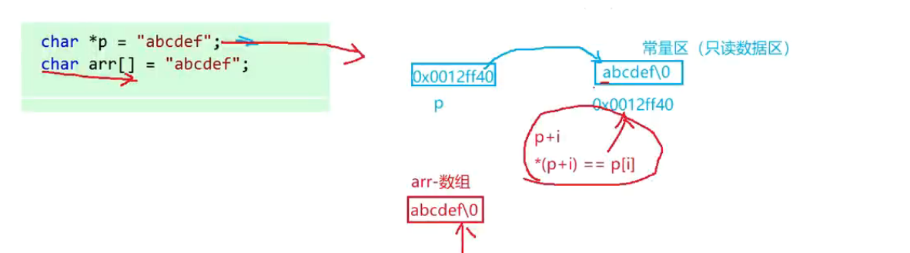

* 字符指针变量指向的是常量，值不能改变，但是指向可以改变
* 数组名是一个地址，地址不可以改变，但是数组内部的元素可以改变 


> 对字符指针变量赋值

```c

char *a;
a = "hello world"; //合法
a[0] = 'r';// 错误，字符串常量不能改变

```

> 不能对字符数组赋值

* 数组名是个地址

```c
char a = "hello world";

a = "hello world2"; // 报错，a不是左值 数组名是个地址
a[0] = 'r'; // 合法

```

###  9.11. <a name='-1'></a>指向函数的指针

1. 编译系统为函数代码分配一段存储空间，这段空间的起始地址（入口地址）称为这个函数的指针
2. 定义使用
  1. `类型名字 (*指针变量名)(函数参数列表)`
3. 如果要用指针指向函数，必须先使指针变量指向该函数
4. 函数指针赋值时，只需要给出函数名 不许给出参数
  1. `int (*p)(int,int) = Add;`
5. 函数调用时，只需要用(*p)代替函数名即可，(*p)(a,b);(也可以不解引用)
  1. `(*p)(a,b)`
6. 对指向函数的指针变量不能进行算数运算
7. 用哈桑农户名调用函数，只能调用所指定的一个函数，而通过指针变量调用函数比较灵活

```c
int Add(int a, int b)
{
  return a + b;
}

int main()
{
  int (*p)(int,int) = Add; // 函数指针,函数名就是函数地址
  printf("%d\n",p(1,2));
}

```

### 用指向函数的指针做函数参数

1. 指向函数的指针的一个重要用途是把函数的地址作为参数传递到其他函数
2. 解除函数冗余

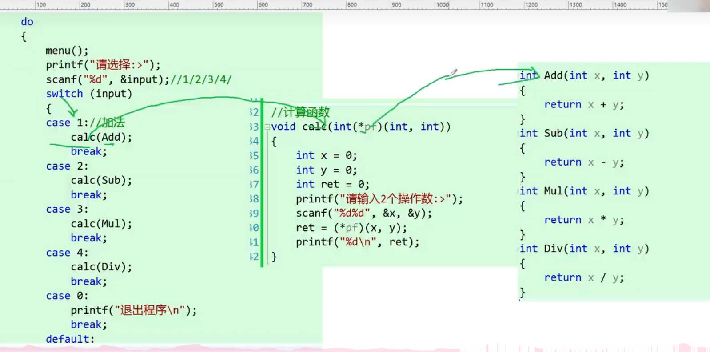

##  10. <a name='.docsort.md'></a>[排序](./doc/sort.md)

##  11. <a name='.doc.md'></a>[关键字](./doc/关键字.md)

##  12. <a name='.doc.md-1'></a>[附录](./doc/附录.md)

##  13. <a name='.doc.md-1'></a>[进制转换](./doc/进制转换.md)

##  14. <a name='.doc.md-1'></a>[变量数据类型问题](./doc/变量数据类型问题.md)